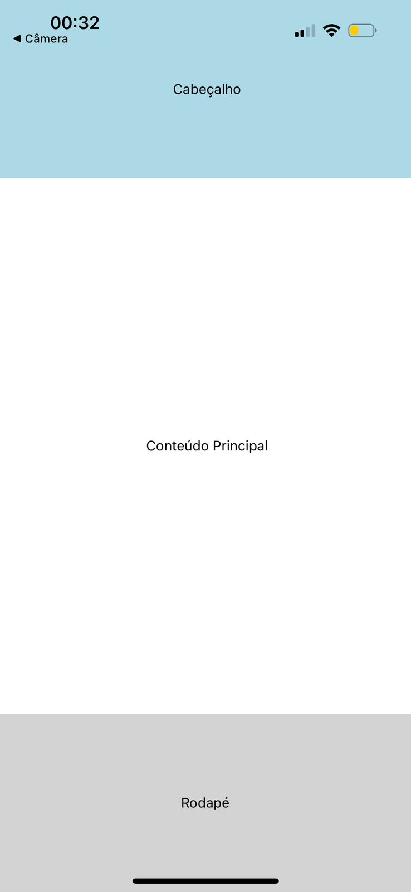

# 📱 Dispositivos Móveis

## 🎯 Objetivo:
Aplicar técnicas e práticas para o desenvolvimento de aplicativos móveis com **React Native**.

## 🛠 Tecnologias Utilizadas:
- ⚛️ **React Native** - Desenvolvimento mobile
- 🚀 **Expo** - Execução e facilitação
- 🌐 **Firebase** - Banco de dados NoSQL com serviço Firestore
- 🔗 **Axios** - Requisições HTTP

## 🗂️ Estrutura do Projeto:

#### EM DESENVOLVIMENTO

## 🧑‍💻 Como executar o Projeto:
1. Clone o repositório:
   ```sh
   git clone https://github.com/nayarasn/Dispositivos_Moveis.git
   ```
2. Acesse a pasta do projeto:
   ```sh
   cd meu-app
   ```
3. Instale as dependências:
   ```sh
   npm install
   ```
4. Inicie o projeto:
   ```sh
   npx expo start
   
<!-- 
   Configuração do Ambiente (.env)
O aplicativo utiliza variáveis de ambiente para configurar o acesso ao Firebase. Abaixo está um exemplo do arquivo .env que você deve criar na raiz do seu projeto:

Importante: Substitua os valores de SUA_API_KEY, SEU_AUTH_DOMAIN, etc., pelas credenciais do seu projeto Firebase. Mantenha este arquivo seguro e não o versionamento no seu sistema de controle de versão (adicione-o ao .gitignore).

Como Iniciar o Projeto com Expo
Para executar o projeto no seu ambiente de desenvolvimento, siga estes passos:

Certifique-se de ter o Node.js e o npm (ou yarn) instalados na sua máquina. Você pode verificar as versões com os seguintes comandos no terminal:

node -v
npm -v
# ou
yarn --version
Se não os tiver instalados, você pode baixá-los em https://nodejs.org/.

Instale o Expo CLI (se ainda não estiver instalado). O Expo CLI é uma ferramenta de linha de comando que ajuda a desenvolver, construir e fazer deploy de aplicativos universais React Native.

npm install -g expo-cli
# ou
yarn global add expo-cli
Clone o repositório do projeto.

git clone git@github.com:IAbrahanArley/appCurso.git
cd appCurso
Instale as dependências do projeto. Navegue até a raiz do seu projeto no terminal e execute:

npm install
# ou
yarn install
Este comando irá instalar todas as bibliotecas e dependências listadas no arquivo package.json, incluindo o React Native, Expo, React Navigation, Firebase (se já instalado), e outras.

Crie o arquivo .env na raiz do seu projeto e adicione as suas credenciais do Firebase conforme mostrado na seção "Configuração do Ambiente".

Inicie o aplicativo com Expo. Execute o seguinte comando no terminal, dentro da pasta do seu projeto:

npx expo start
# ou
yarn start
Este comando irá abrir o Expo Developer Tools no seu navegador. Você terá várias opções para executar o aplicativo:

Run on Android device/emulator: Abre o aplicativo em um dispositivo Android físico conectado ou em um emulador configurado.
Run on iOS simulator: Abre o aplicativo no simulador do iOS (disponível apenas em macOS).
Run in web browser: Abre uma versão web do seu aplicativo (algumas funcionalidades nativas podem não estar disponíveis).
Leia o QR code com o aplicativo Expo Go no seu dispositivo (para dispositivos físicos). Se você escolher executar no seu dispositivo Android ou iOS, certifique-se de ter o aplicativo Expo Go instalado. Escaneie o QR code mostrado no Expo Developer Tools com a câmera do seu dispositivo através do aplicativo Expo Go.
   ```
 -->

## 📌 Acompanhe o projeto:

- ### Aula 01 
### Exercício 1

### Exercício 2

- ### Aula 02 
### Exercício 1
